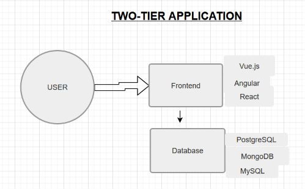
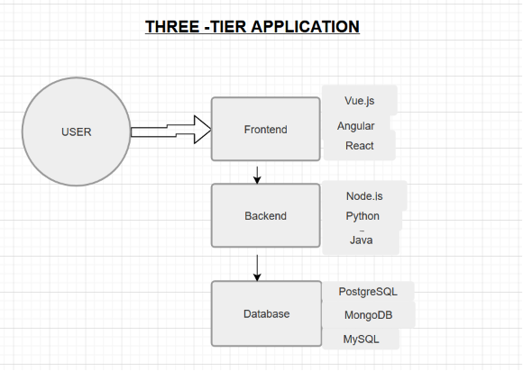
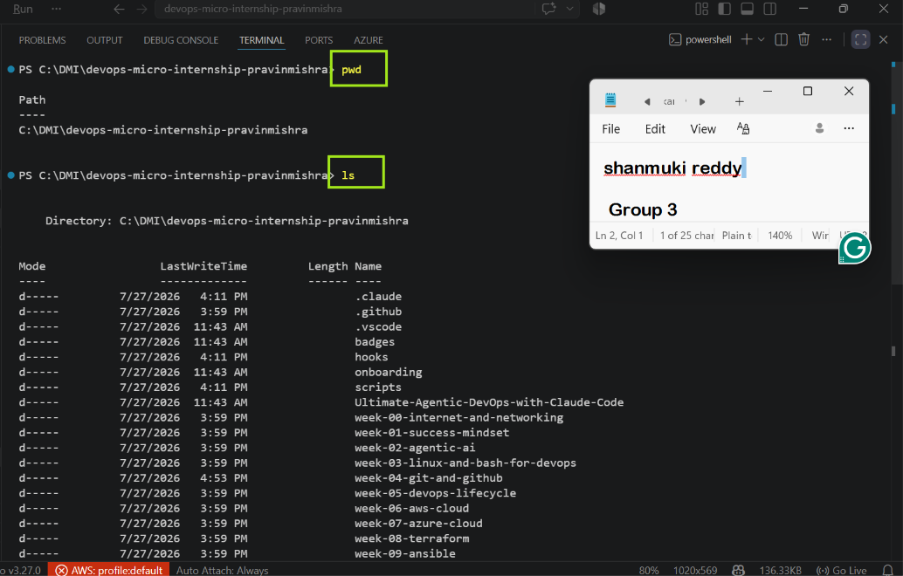

# Week 00 - Internet and Networking

Part of the DevOps Micro Internship (DMI) Cohort 3 with Agentic AI

---

# 🧑‍💻 Task 1: Using ChatGPT as Your Learning Assistant

## Scenario

You're new to DevOps and will frequently encounter technical questions. ChatGPT can be your learning companion.

## Your Task

Write a clear ChatGPT prompt to help you understand:

> "What is a protocol in networking? Explain with a simple real-life example."

Take a screenshot of your interaction showing:

* Your detailed prompt (with clear expectations)
* ChatGPT's simplified response with an example

## Screenshot

Save your screenshot in the `screenshots` folder and update the file name below.


Replace `task-1-chatgpt.png` with your actual screenshot file name.

---

## What I Learned (2–3 lines)

I learned that networking protocols are standard rules that allow devices to communicate correctly over a network. Using a real-life example helped me understand how protocols organise communication, just like traffic rules help vehicles move safely.

---

# 🌐 Task 2: Internet and Networking

## Scenario

Your friend is launching an online bookstore named **EpicReads**.

He asked you to explain how users globally can access his website hosted in Finland.

## Your Task

Write a short explanation (**100–150 words**) that includes:

* Packet Switching
* IP Address
* TCP/IP
* HTTP/HTTPS

💡 **Tip:** You may use ChatGPT (as demonstrated in Task 1) to refine your explanation.

## Answer

When a user visits EpicReads from anywhere in the world, their request is broken into small pieces called packets through packet switching. These packets travel across different network paths and are reassembled when they reach the server in Finland. Every device connected to the internet has an IP address, which identifies where data should be sent. The TCP/IP protocol suite ensures that packets are delivered reliably, in the correct order, and without missing information. Once the connection is established, HTTP or HTTPS is used to transfer website data between the user's browser and the web server. HTTPS encrypts the communication, protecting sensitive information such as login credentials and payment details. Together, these technologies allow users worldwide to access the EpicReads website securely and reliably.

---

# 🏗️ Task 3: Application Architecture & Stack

## Scenario

EpicReads bookstore has two application versions:

### Two-Tier Application

* Frontend
* Database

### Three-Tier Application

* Frontend
* Backend
* Database

## Your Task

* Draw simple diagrams (hand-drawn or tool-based such as draw.io)
* Label each layer clearly
* List at least two common technologies or tools used for each layer
* Submit a screenshot or photo clearly showing your own drawing

## Diagram Screenshot / Photo

Save your diagram image in the `screenshots` folder and update the file name below.






Replace `task-3-diagram.png` with your actual diagram file name.

---

## Technologies Used

### Frontend

* HTML, CSS, JavaScript,Vue.js
* React
* Angular

### Backend

* Node.js, Express.js
* java
* Python

### Database

* MySQL
* PostgreSQL
* MongoDB

---

# 🌍 Task 4: Domain Name & DNS (Basic Concepts)

## Scenario

Your friend's bookstore **EpicReads** is currently accessible through:

```text
52.172.142.222:3000
```

He purchased the domain:

```text
epicreads.com
```

## Your Task

In **50–100 words**, explain in your own words:

1. What is DNS (Domain Name System)?
2. Which DNS record type should be used to connect the domain to the given IP, and why?

## Answer

1. DNS (Domain Name System) translates a human-readable domain name, such as epicreads.com, into the IP address of the server where the website is hosted. This allows users to access websites without remembering numerical IP addresses.
2. To connect epicreads.com to the IP address 52.172.142.222, an A record should be used because it maps a domain name directly to an IPv4 address.

---

# 💻 Task 5: Visual Studio Code Setup (Hands-on)

## Your Task

Install Visual Studio Code (if not already installed).

Take a screenshot of your VS Code environment showing:

* Terminal open inside VS Code
* Running a basic command:

### Windows

```powershell
dir
```

### Linux / macOS

```bash
pwd
ls
```

* Your selected VS Code theme clearly visible

⚠️ **Important:** The screenshot must show your username or another identifiable detail to confirm it is your environment.

## Screenshot

Save your screenshot in the `screenshots` folder and update the file name below.



---

# 🔗 Task 6: Publish Your Assignment as a LinkedIn Post

## Objective

Publishing on LinkedIn helps you:

* Build your professional online presence
* Reinforce your learning
* Document your DevOps journey publicly

## Your Task

Summarize your answers from Tasks 1–5 into a LinkedIn post.

Clearly structure your post into the following sections:

* ChatGPT
* Internet & Networking
* App Architecture
* DNS
* VS Code Setup

Add the following credit note at the end of your post:

> **P.S. This post is part of the DevOps Micro Internship (DMI) with Agentic AI — Cohort 3 — by Pravin Mishra. My graded progress is public: https://dmi.pravinmishra.com/s/YOUR-GITHUB-USERNAME.html · Start your DevOps journey: https://dmi.pravinmishra.com/?utm_source=student&utm_medium=ps-linkedin&utm_campaign=cohort3**

---

## LinkedIn Post URL

https://www.linkedin.com/posts/shanmuki-reddy_devops-devops-cloudcomputing-activity-7469138436348776448-9O7e?utm_source=share&utm_medium=member_desktop&rcm=ACoAAE0LbgwBcO3gizrVfuqLPvGD60OHg7LFHRw

```

---

## LinkedIn Post Backup Copy

🚀 🚀 Excited to Start My DevOps Learning Journey guided by Pravin Mishra under @DevOpsMicroInternship (DMI) 🚀🚀
I’ve completed Week 0 of the hashtag#DevOps Micro Internship Cohort 3, where I focused on building a strong foundation in how the internet works, how applications are structured, and setting up essential development tools.
This week was all about understanding the core building blocks of modern systems.
🧠 1. ChatGPT as a Learning Aid
I used AI to simplify complex networking concepts and reinforce my understanding through real-world analogies.
Networking Protocols: A defined set of rules that enables communication between systems, covering data formatting, transmission, reception, and error handling.

🌐 2. Internet & Networking Fundamentals
Using a real-world scenario (accessing a web application hosted in a different region), I explored how data travels across the internet:
Packet Switching: Data is broken into smaller packets, transmitted via different routes, and reassembled at the destination.
IP Address: A unique identifier that defines the location of a server or device on the network.
TCP/IP: Core communication protocol suite ensuring reliable data transfer across networks.
HTTP/HTTPS: Protocols used for web communication, with HTTPS adding encryption and security.
🏗️ 3. Application Architecture (2-Tier vs 3-Tier)
I studied how applications are structured for scalability, maintainability, and performance:
2-Tier Architecture: Direct communication between frontend and database.
3-Tier Architecture: Introduces a backend layer between frontend and database, separating business logic and improving scalability and security.
🌍 4. Domain Name System (DNS)
I explored how human-friendly domain names map to machine-readable IP addresses.
DNS (Domain Name System): Acts as the internet’s address resolution system.
A Record: Maps a domain name to an IPv4 address.
Example: Converting epicreads.com into its corresponding server IP.
💻 5. VS Code & Command Line Basics
I set up Visual Studio Code and practiced essential CLI commands using the integrated terminal:
pwd → Displays current directory
ls / dir → Lists files and folders in a directory
📌 Summary
This week helped me build a strong conceptual foundation in networking and system architecture, which is essential for progressing further in DevOps.
Looking forward to diving deeper. You can be part of this learning community too. 
JOIN HERE (https://lnkd.in/dhurmKWy ) 
DMI Cohort 3: https://lnkd.in/deYTkw22
Pravin Mishra Profile: https://lnkd.in/dRniAR8y

P.S. This post is part of the DevOps Micro Internship (DMI) with Agentic AI — Cohort 3 — by Pravin Mishra. My graded progress is public: https://lnkd.in/ef3KYbtW · Start your DevOps journey: https://lnkd.in/eWFtiGT6

#DevOps #CloudComputing #Networking #LearningJourney #Internship #VSCode #DNS #DevOpsEngineer


---

# Reflection – Week 0

### What did you find easy?

Understanding the basic concepts of networking and using ChatGPT to simplify technical topics was straightforward. Setting up Visual Studio Code was also easy.

---

### What was difficult?

Understanding the basic concepts of networking and using ChatGPT to simplify technical topics was straightforward. Setting up Visual Studio Code was also easy.

---

### What will you improve next week?

Learning how packet switching, TCP/IP, and DNS work together required some additional reading because each component has a different responsibility in network communication.

---

## 📌 About DMI & CloudAdvisory

DevOps Micro Internship (DMI) is a project-based DevOps program run by Pravin Mishra (The CloudAdvisory) focused on real-world execution, systems thinking, and career readiness.

It helps learners build strong DevOps foundations with hands-on experience.


## 📌 Resources

- 🌐 **DMI Official Website:** https://dmi.pravinmishra.com?utm_source=github&utm_medium=readme  
- 🎓 **University:** https://university.pravinmishra.com?utm_source=github&utm_medium=readme  
- 💬 **Discord Community:** https://discord.pravinmishra.com?utm_source=github&utm_medium=readme  
- 📝 **Blog:** https://dmi.pravinmishra.com/blog?utm_source=github&utm_medium=readme  
- ▶️ **YouTube Playlist (DMI Cohort 3):** https://www.youtube.com/playlist?list=PLFeSNDtI4Cho  
- 🔗 **Pravin Mishra (LinkedIn):** https://www.linkedin.com/in/pravin-mishra-aws-trainer/  
- 🏢 **CloudAdvisory (LinkedIn):** https://www.linkedin.com/company/thecloudadvisory/

---

*This submission is part of DevOps Micro Internship (DMI) Cohort 3 — Agentic AI Track*