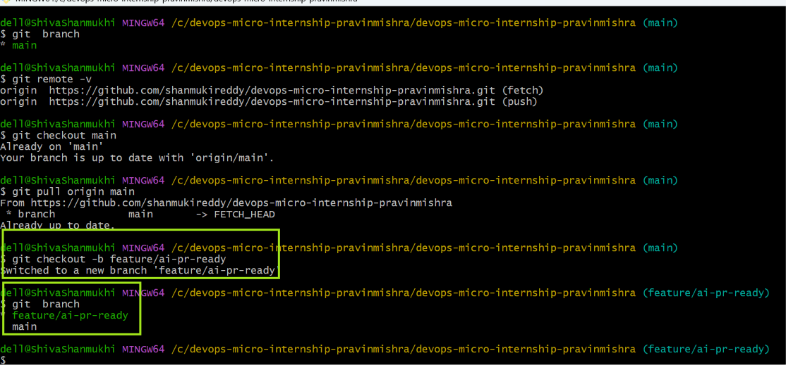
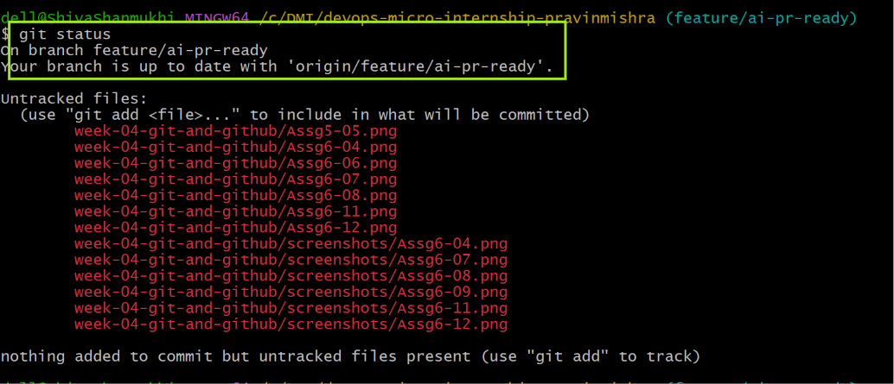
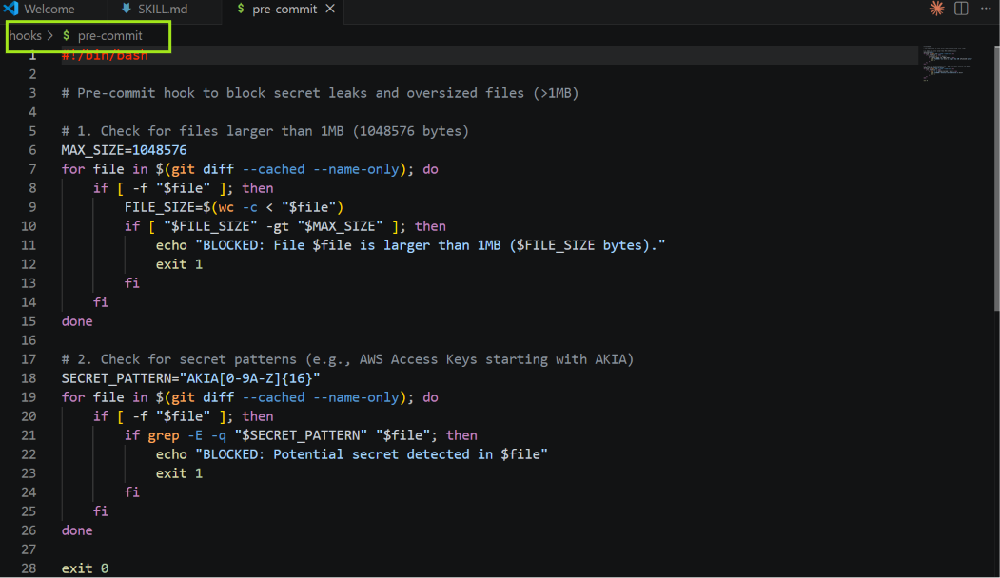
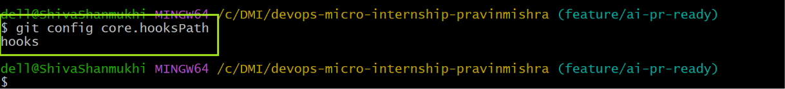
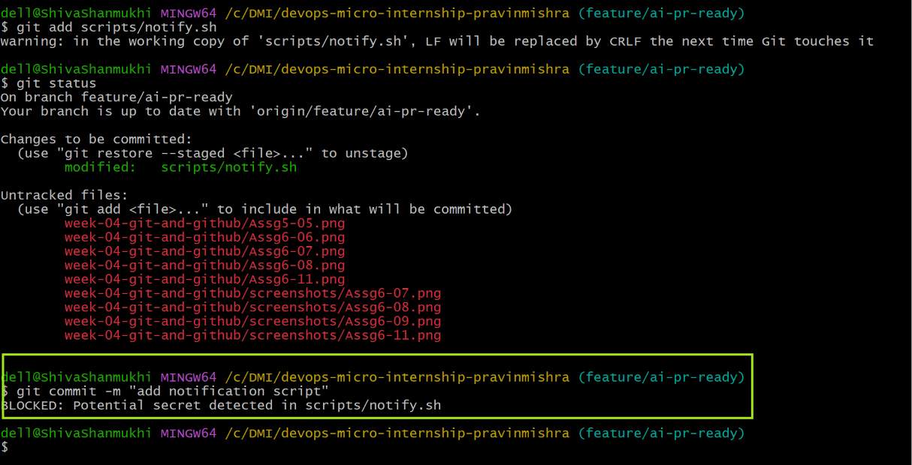
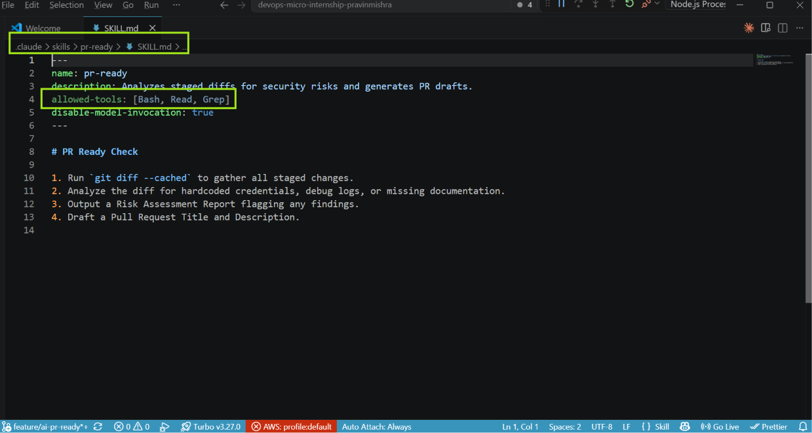
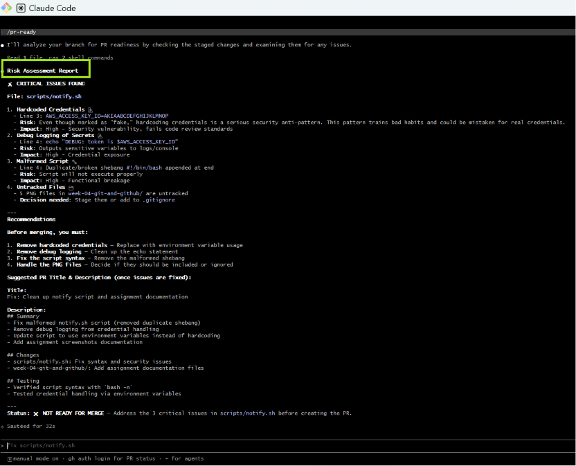
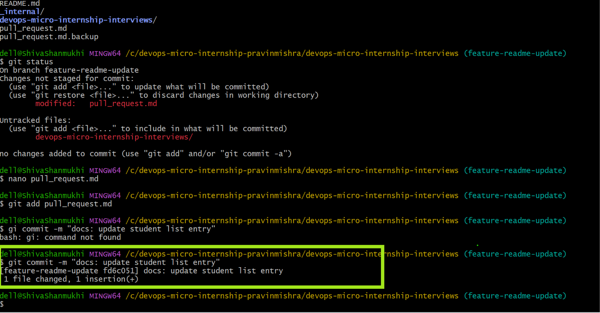
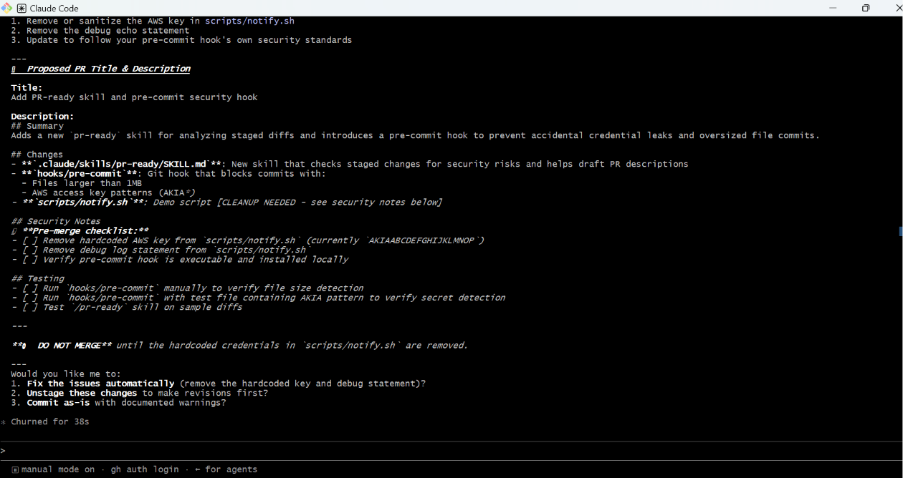
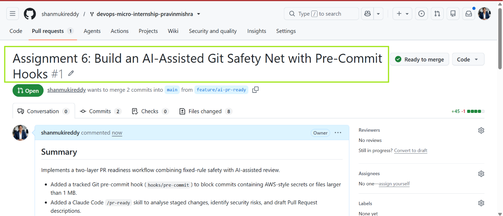

# Assignment 6 — Building an AI-Assisted Git Safety Net (PR Ready Check)

Part of the DevOps Micro Internship (DMI) Cohort 3 with Agentic AI

---

## Purpose

In Week 2 you built Claude Code hooks that block a dangerous action *before* it happens (`PreToolUse`), and a restricted skill that could look but not touch (`allowed-tools` without `Write`). In this assignment you will discover that Git has the exact same idea, decades older: a **pre-commit hook** that blocks a commit before it's created.

You will build both halves of a real "PR Ready" workflow:

1. A **Git hook that follows fixed rules** — scans staged changes for hardcoded secrets and oversized files and refuses the commit. No AI involved, no guessing, just a rule that gives the same answer every time.
2. A **restricted Claude Code skill** (`/pr-ready`) that reads your staged diff and drafts a Pull Request title, description, and a short list of things worth a second look — the kind of judgment a fixed rule can't make (mixed changes, missing context, unclear intent). The skill never commits, pushes, or opens the PR. You do that yourself, using its draft as a starting point.

This mirrors the Agentic Loop from Week 3's Linux triage assignment: **Gather → Analyze → Human Act → Verify**. The hook and the skill both gather and analyze; only you act.

---

# Task 0 — Confirm Your Fork and Create a Feature Branch

## Goal

Confirm you are working in your own fork, then create a dedicated branch for this assignment.

### Evidence

#### Screenshot 1 — Output of git remote -v and git branch showing the new branch

---

### Notes

**1. Why create a dedicated branch instead of doing this work on main?**

A dedicated feature branch isolates changes from the main branch. It allows developers to safely test, review, and modify work without affecting the stable codebase. It also supports collaboration because changes can be reviewed through a Pull Request before being merged.

---

# Task 1 — Stage a Change With Realistic Risk

## Goal

On your own fork of this repository (the one you've been submitting your DMI work in since onboarding), create a new branch and stage a change that a real reviewer should catch: a hardcoded-looking secret and a leftover debug statement.

### Evidence

#### Screenshot 1 — Output of  `git status` showing the staged file on feature/ai-pr-ready

--- 

### Notes

**1. Why does this assignment use an obviously fake key instead of a real one?**

The fake AWS key demonstrates how secret detection works without exposing an actual credential. Real credentials must never be placed in source code because they could allow unauthorised access to cloud resources and create security incidents.

---

# Task 2 — Write a Real Git Pre-Commit Hook

## Goal

Create a tracked, shareable pre-commit hook that blocks a commit containing secret-like patterns or files over 1MB.

### Evidence

#### Screenshot 2 — `hooks/pre-commit` open in VS Code showing the full script

---

#### Screenshot 3 — Output of `git config core.hooksPath` confirming it points to `hooks`

---

### Notes

**1. Why is `hooks/pre-commit` tracked in the repo instead of living only in `.git/hooks/`?**

The .git/hooks/ directory is local to each developer's machine and is not committed to Git. By storing the hook inside the repository under hooks/, the team can share the same validation rules and ensure everyone uses the same safety checks.
---

**2. Compare this to `PreToolUse` from Week 2 Assignment 6. What does each one intercept, and what do they have in common?**

The Git pre-commit hook intercepts Git commit operations before changes are permanently recorded in the repository. It checks staged files for problems such as secrets or oversized files.

The Claude Code PreToolUse hook intercepts AI tool actions before execution and can prevent unsafe operations.

Both are preventive safety controls. They inspect an action before it happens and enforce rules to reduce risk.

---

# Task 3 — Prove the Hook Blocks the Risky Commit

## Goal

Attempt to commit the staged file from Task 1 and show the hook rejecting it.

### Evidence

#### Screenshot 4 — Terminal showing `git commit` rejected with the hook's "BLOCKED" message naming the exact file

---

### Notes

**1. Which line in `hooks/pre-commit` matched your fake key, and why did it match?**

"grep -qE 'AKIA[0-9A-Z]{16}|-----BEGIN (RSA|OPENSSH|PRIVATE) KEY-----'"
It matched because the fake AWS key began with AKIA followed by 16 uppercase letters, which exactly matches the regular expression used by the hook.
---

**2. Could this hook have caught a poorly-named variable that stores a secret without the `AKIA` prefix? What does that tell you about the limits of a fixed rule like this?**

No. If a secret does not match one of the predefined patterns, the hook will not detect it. This shows that rule-based checks are fast and reliable for known patterns, but they cannot understand context or recognise every possible secret.

---

# Task 4 — Build the `/pr-ready` Skill

## Goal

Create a manually invoked Claude Code skill that reads your staged changes and produces a PR-readiness report and a draft PR description — without writing, committing, or pushing anything itself.

### Evidence

#### Screenshot 5 — `SKILL.md` frontmatter showing `allowed-tools: Bash, Read, Grep` (no `Write`) and `disable-model-invocation: true`

---

#### Screenshot 6 — `/pr-ready` output while the risky file is still staged, showing it flagged the secret and/or debug statement

---

### Notes

**1. Why does `/pr-ready` have `Bash` and `Read` but not `Write`?**

The skill only needs to inspect the repository and analyse the staged changes. It does not need permission to modify files or perform Git operations. Removing Write permission ensures the AI cannot accidentally change code, create commits or push changes, leaving those decisions under human control.

---

**2. The pre-commit hook and `/pr-ready` both looked at the same staged diff. Did they flag the same things? What did one catch that the other didn't?**

Both identified the fake AWS key in the staged file. The pre-commit hook blocked the commit because it matched a predefined pattern. The /pr-ready skill also identified the debug echo statement and explained why it was a security concern. Unlike the hook, it provided a draft Pull Request title and description and highlighted issues requiring human review.

---

# Task 5 — Fix the Issues and Re-Verify

## Goal

Remove the secret and debug statement, then prove both gates now pass clean.

### Evidence

#### Screenshot 7 — `git commit` succeeding after the fix (no BLOCKED message)

---

#### Screenshot 8 — Second `/pr-ready` run showing a clean risk report and a drafted PR title + description

---

### Notes

**1. What exactly did you change to satisfy the pre-commit hook?**

I removed the fake AWS access key and deleted the debug echo statement that printed the credential. I replaced them with a simple placeholder message so the script no longer contained secret-like content or exposed sensitive information. After staging the updated file, the pre-commit hook completed successfully and allowed the commit.

---

# Task 6 — Push and Open a Pull Request Using the AI Draft

## Goal

Push your branch and open a real Pull Request, using `/pr-ready`'s drafted title and description as your starting point — read it critically and edit before you use it.

**Important:** Open this Pull Request with base repository set to **your own fork** — not the shared upstream `pravinmishraaws/devops-micro-internship-pravinmishra` repository. This assignment's hook and skill files are your own practice work, not a change meant for the shared class repo.

### Evidence

#### Screenshot 9 — Your Pull Request showing the base repository is your own fork, plus the title and description, with the `/pr-ready` draft visible for comparison (paste it in the PR conversation or your notes below)

---

#### PR Link

https://github.com/shanmukireddy/devops-micro-internship-pravinmishra/pull/1

---

### Notes

**1. What, if anything, did you edit in the AI's drafted PR description before using it? Why?**

I reviewed the AI-generated draft and made small edits to improve its accuracy and clarity. I ensured it correctly described the completed work, removed anything that was no longer relevant after fixing the issues, and confirmed it reflected the final state of the code before submitting the Pull Request.

---

**2. If you had blindly copy-pasted the AI's draft without reading it, what could go wrong?**

The AI's draft could contain incorrect or outdated information, especially if the code changed after the review. It might also omit important details or describe work that was never completed. Reviewing the draft ensures the Pull Request accurately represents the changes being submitted.

---

**3. Why does this PR need to target your own fork instead of the shared upstream repository?**
This assignment is a practice exercise, not a contribution to the original project. Opening the Pull Request against my own fork keeps the upstream repository clean and follows the assignment instructions while demonstrating the complete GitHub workflow.

---

# Task 7 — Map the Workflow to the Agentic Loop

## Goal

Explain this assignment's workflow using the same Gather → Analyze → Human Act → Verify structure from Week 3.

### Notes

**1. Which step(s) represent Gather?**

The Gather stage includes collecting information about the staged changes using commands such as git status and git diff --cached. The /pr-ready skill also gathers information by reading the staged files before analysing them.

---

**2. Which step(s) represent Analyze?**

The Analyze stage is performed by both the Git pre-commit hook and the /pr-ready skill. The pre-commit hook checks for predefined security risks, while /pr-ready reviews the staged changes, identifies potential issues, and generates a draft Pull Request.

---

**3. Which step is Human Act, and why must a human — not Claude — run `git commit`, `git push`, and open the PR?**

The Human Act stage is when I review the findings, fix the detected issues, commit the changes, push the branch, and create the Pull Request. These actions change the repository and require human judgement to ensure the correct code is submitted and shared.

---

**4. Which step is Verify?**

The Verify stage involves running the pre-commit hook again, re-running /pr-ready, confirming that the commit succeeds without errors, checking that the working tree is clean, and verifying that the Pull Request contains the correct changes.

---

**5. In one or two sentences: why do you need *both* the fixed-rule pre-commit hook and the AI skill? Isn't one enough?**

The pre-commit hook quickly blocks known problems using fixed rules, while the AI skill reviews the overall change and provides context-aware feedback. Together they provide stronger protection because they complement each other's strengths and limitations..

---

# Task 8 — LinkedIn Post

## Goal

Publish a LinkedIn post summarizing what you built and what you learned about combining fixed-rule safety checks with AI-assisted review.

### Evidence

#### LinkedIn Post URL

https://www.linkedin.com/posts/shanmuki-reddy_devops-git-github-ugcPost-7486384478773485568-G2mM/?utm_source=share&utm_medium=member_desktop&rcm=ACoAAE0LbgwBcO3gizrVfuqLPvGD60OHg7LFHRw

---

## Key Learnings

Add 3-5 bullet points on what you learned this week.

- Learned how professional Git workflows use forks, branches, and Pull Requests to protect shared repositories and support safe collaboration.
- Improved my understanding of Linux server management by deploying applications, configuring Nginx, and performing production troubleshooting checks.
- Learned that automation scripts and health checks can reduce manual effort and improve reliability during system maintenance.
- Understood how Git hooks provide preventive security controls by blocking risky changes before they enter the repository.
- Learned that AI-assisted tools are powerful for analysis and review, but human judgement is still required for committing, pushing, and approving changes.

---

# Submission Instructions

- Ensure `hooks/pre-commit` and `.claude/skills/pr-ready/SKILL.md` are committed to your GitHub repository
- Add all required screenshots to your submission
- All written answers must be in your own words
- Do not use a real secret or credential anywhere in your submission — the fake key in Task 1 is intentional and must stay clearly fake
- Open your Pull Request against your own fork, not the shared upstream repository
- Push your final changes to your forked repository
- Include your PR link and LinkedIn post URL

---

## GitHub Repository URL

Paste your forked repository URL here:

https://github.com/shanmukireddy/devops-micro-internship-pravinmishra

---

# Completion Checklist

- [ ] Branch `feature/ai-pr-ready` created with a staged file containing a fake secret and a debug statement
- [ ] `hooks/pre-commit` created and tracked in the repo (not only in `.git/hooks/`)
- [ ] `core.hooksPath` configured to point at `hooks/`
- [ ] Pre-commit hook shown blocking the risky commit
- [ ] `.claude/skills/pr-ready/SKILL.md` created with correct `allowed-tools` (no `Write`) and `disable-model-invocation: true`
- [ ] `/pr-ready` run against the risky diff and shown flagging issues
- [ ] Risky file fixed; `git commit` succeeds cleanly
- [ ] `/pr-ready` re-run showing a clean report and drafted PR title/description
- [ ] Pull Request opened using the AI draft as a starting point, with your own fork as the base repository (not upstream), PR link included
- [ ] Agentic Loop mapping (Task 7) completed in your own words
- [ ] LinkedIn post published and URL submitted
- [ ] All required screenshots added
- [ ] GitHub repository URL provided

---

## 📌 About DMI & CloudAdvisory

DevOps Micro Internship (DMI) is a project-based DevOps program run by Pravin Mishra (The CloudAdvisory) focused on real-world execution, systems thinking, and career readiness.

It helps learners build strong DevOps foundations with hands-on experience.

---

## 📌 Resources

- 🌐 DMI Official Website: https://pravinmishra.com/dmi  
- 🎓 DevOps for Beginners (Udemy): https://www.udemy.com/course/devops-for-beginners-docker-k8s-cloud-cicd-4-projects/  
- 🎓 Agentic AI DevOps with Claude Code: https://www.udemy.com/course/ultimate-agentic-ai-devops-with-claude-code/  
- 🎓 DevOps with Claude Code: Terraform, EKS, ArgoCD & Helm: https://www.udemy.com/course/devops-with-claude-code-terraform-eks-argocd-helm/  
- ▶️ YouTube Playlist: https://www.youtube.com/playlist?list=PLFeSNDtI4Cho  
- 🔗 Pravin Mishra (LinkedIn): https://www.linkedin.com/in/pravin-mishra-aws-trainer/  
- 🏢 CloudAdvisory (LinkedIn): https://www.linkedin.com/company/thecloudadvisory/

---

*This submission is part of DevOps Micro Internship (DMI) Cohort 3 — Agentic AI Track.*
 