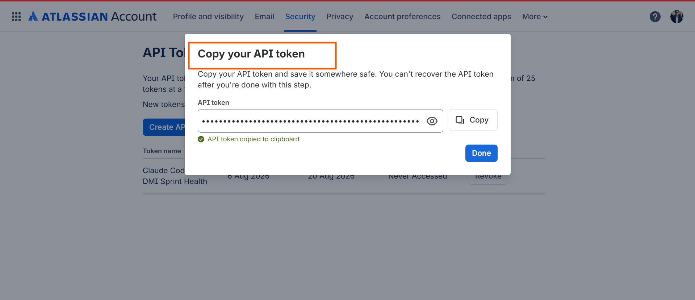
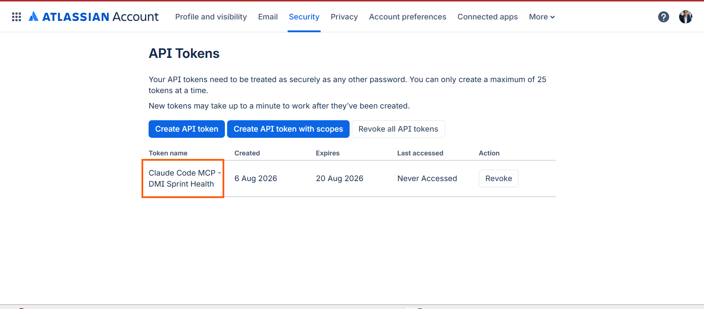
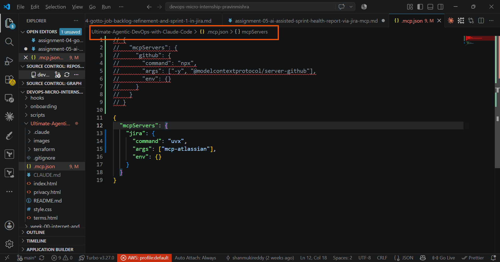
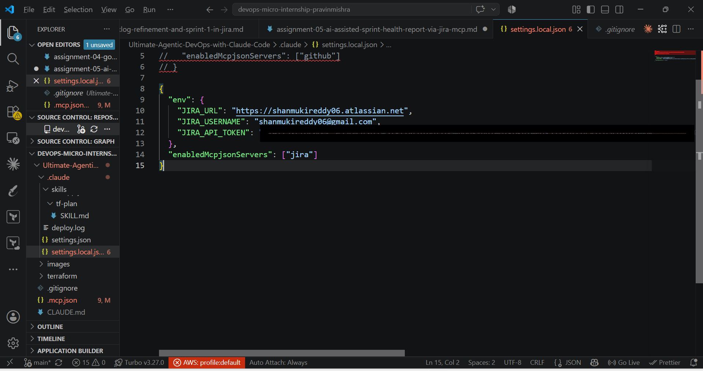
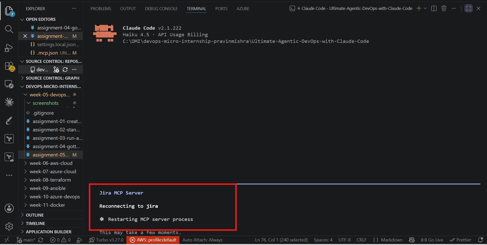
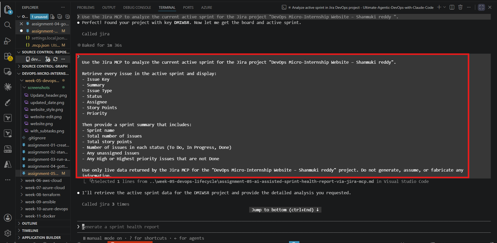
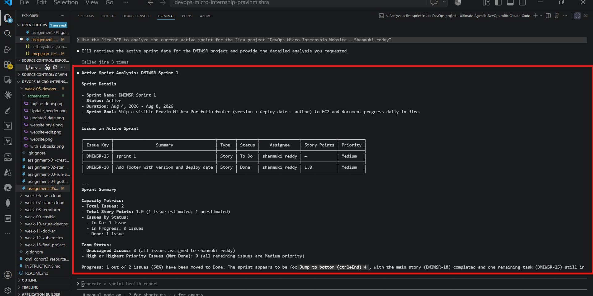
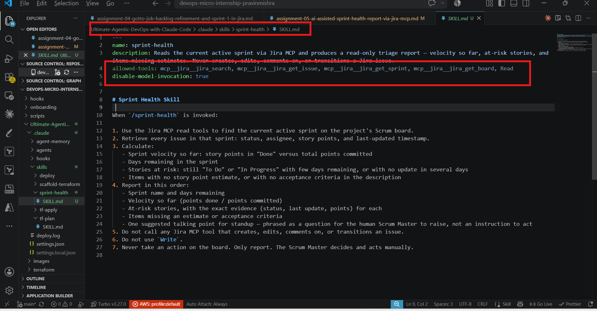
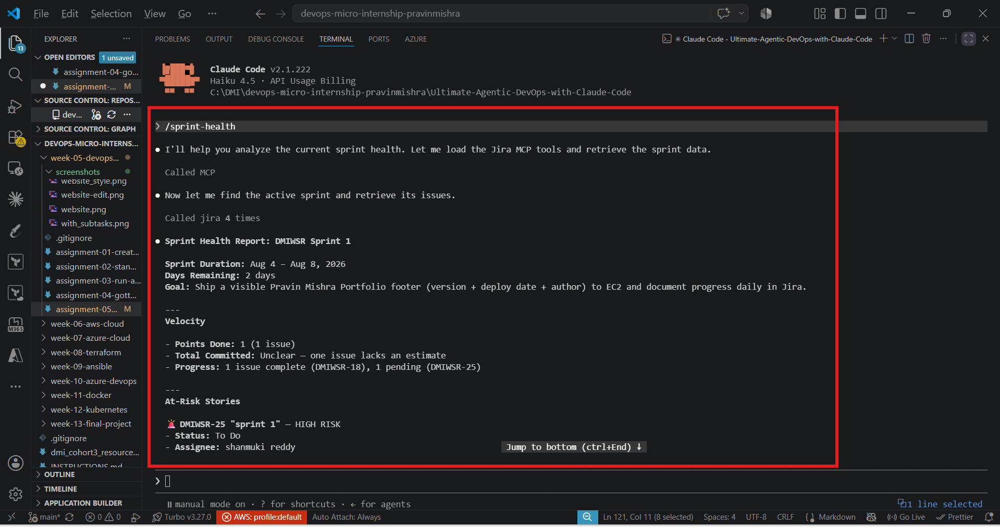
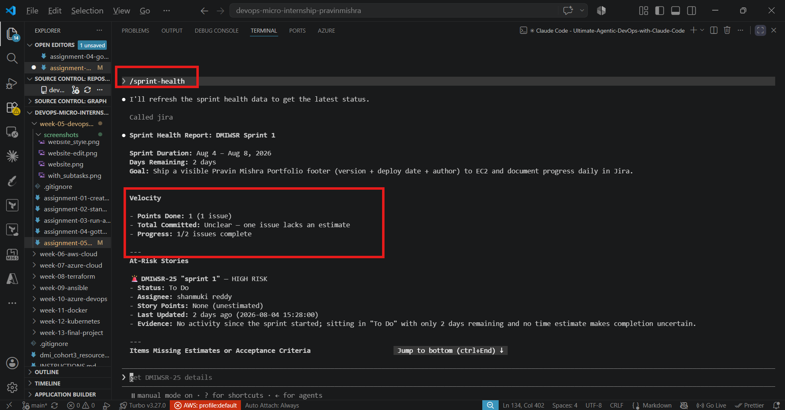

# Assignment 5 — AI-Assisted Sprint Health Report via Jira MCP

Part of the DevOps Micro Internship (DMI) Cohort 3 with Agentic AI

---

## Purpose

In this assignment, you will connect Claude Code to your Jira board through an MCP server, the same way you connected it to GitHub in Week 2, and build a read-only `/sprint-health` skill. The skill reads your current sprint through Jira's API and reports sprint velocity, stories at risk of missing the sprint, and items missing an estimate — but it must never create, edit, comment on, or transition a single ticket itself. You will prove that boundary holds by making a real change on the board yourself and confirming the skill only ever reports, never acts.

---

# Task 1 — Create a Jira API Token

## Goal

Generate an API token from your Atlassian account that the MCP server will use to authenticate with your Jira site. Do not screenshot the token value itself.

### Evidence

#### Screenshot 1 — Jira API token creation confirmation page showing the token name, with the token value not visible

### Notes You Must Write (Very Important):

Why does the MCP server need your site URL and account email in addition to the token?

The API token only proves authentication, but it does not identify which Jira organisation/site to connect to or which Atlassian account should be used. The site URL tells the MCP server which Jira instance to access, while the account email identifies the Atlassian user associated with the token. Together, the site URL, email, and token allow the MCP server to securely authenticate and interact with the correct Jira account.

---

# Task 2 — Create .mcp.json at the Project Root

## Goal

Create or update `.mcp.json` at your project root with a Jira MCP server block, following the same shape as the GitHub MCP server you configured in Week 2.

### Evidence

#### Screenshot 2 — `.mcp.json` open in VS Code showing the Jira server configuration

### Notes You Must Write (Very Important):

Compare this jira block to the github block from Week 2 Assignment 5. The GitHub server ran via npx (a Node.js package); this one runs via uvx (a Python package) — what stays exactly the same shape despite that difference, and why doesn't Claude Code care which language a given MCP server is written in?

The Jira MCP server block follows the same structure as the GitHub MCP server block from Week 2. Both define an MCP server name, the command used to start the server, the required arguments, and environment variables for authentication or configuration. The main difference is the runtime command: GitHub MCP uses npx because it is distributed as a Node.js package, while Jira MCP uses uvx because it is distributed as a Python package.

Claude Code does not need to know which programming language the MCP server is written in because MCP uses a standard communication protocol. Claude Code only communicates with the server through the MCP interface, which exposes tools and resources in a consistent format. The underlying implementation language is hidden behind the protocol.

---

# Task 3 — Add Your Credentials to settings.local.json

## Goal

Add your Jira site URL, account email, and API token to `.claude/settings.local.json`, and confirm that file is listed in `.gitignore` so it is never committed.

### Evidence

#### Screenshot 3 — `settings.local.json` open in VS Code showing the `env` section, with the actual token value blurred or covered

### Notes You Must Write (Very Important):

Why must JIRA_API_TOKEN live in settings.local.json and never in .mcp.json?

The JIRA_API_TOKEN must live in settings.local.json because it is a sensitive credential used for authentication and should remain local to the developer's environment. The .mcp.json file defines the MCP server configuration and may be shared with the project, but it should not contain secrets.

Keeping the API token in settings.local.json prevents accidental exposure through Git commits, code reviews, or repository sharing. The .gitignore entry ensures that local credential files are excluded from version control while Claude Code can still access the required environment variables locally.

---

# Task 4 — Verify the Connection with /mcp

## Goal

Restart Claude Code and confirm the Jira MCP server shows as connected.

### Evidence

#### Screenshot 4 — `/mcp` output showing `jira: connected`

---

# Task 5 — Run a Live Query to Prove Real Board Data

## Goal

Ask Claude to list the issues in your current active sprint through the Jira MCP connection, and confirm the result matches what you see on your live board in the browser.

### Evidence

#### Screenshot 5 — Claude's response showing the live sprint issue list retrieved via Jira MCP

### Notes You Must Write (Very Important):

How did you confirm this was real board data and not something Claude guessed?

I confirmed the data was real board data by comparing Claude's Jira MCP response with the active sprint board shown in Jira. The issue keys, summaries, and statuses returned by Claude matched the issues visible on the live Jira board. Since issue keys are unique identifiers generated by Jira, matching them confirmed that Claude retrieved the data through the MCP connection rather than generating or guessing the information.

---

# Task 6 — Build the /sprint-health Skill

## Goal

Create a `/sprint-health` skill restricted to read-only Jira tools plus `Read`, with no issue-mutating tools and no `Write`. Run it and confirm it produces a report covering sprint velocity, at-risk stories, and items missing an estimate.

### Evidence

#### Screenshot 6 — `SKILL.md` frontmatter showing `allowed-tools` limited to read-only Jira tools plus `Read`, with `disable-model-invocation: true`

#### Screenshot 7 — `/sprint-health` output showing the full triage report against your real sprint

### Notes You Must Write (Very Important):

1. Which Jira MCP tools does this skill's allowed-tools list include, and which mutating tools (create issue, update issue, transition issue, add comment) does it deliberately exclude?

The skill's allowed-tools list includes only read-only Jira tools required to retrieve sprint information, search issues, and read issue details. It deliberately excludes all mutating Jira tools such as create issue, update issue, transition issue, and add comment because the purpose of the skill is analysis only and it should never change the Jira board state.

2. Why does a Scrum Master need this restriction more than almost any other role in this course?
A Scrum Master relies on accurate, transparent board information to facilitate planning, tracking, and team decisions. A read-only restriction prevents accidental changes to sprint data, which could affect velocity calculations, reporting accuracy, and team accountability. The Scrum Master role is focused on enabling the team and inspecting process health, not modifying delivery data automatically.
---

# Task 7 — Prove the Skill Never Mutates the Board

## Goal

Manually update one ticket on your board in the browser (for example, move a story to "Done" or add a missing estimate), then run `/sprint-health` again and confirm the new report reflects your change — proving the skill only ever reads live state and never wrote to the board itself.

### Evidence

#### Screenshot 8 — Second `/sprint-health` run showing the report now reflects your manual board change

### Notes You Must Write (Very Important):

Map this assignment to Gather → Analyze → Human Act → Verify from Week 3 Assignment 6. Which step did you perform manually in the browser, and why must that step stay human?

This assignment follows the Gather → Analyze → Human Act → Verify workflow from Week 3 Assignment 6. The manual browser update was the Human Act step. This step must remain human because changes to sprint scope, estimates, status, and delivery decisions require team context and accountability. The AI skill should provide insights from live data but should not make autonomous changes that could affect the team's workflow.

---

# Submission Instructions

Complete all tasks in sequence.

Your submission must include:
- All 8 required screenshots
- All the required notes

---

# Completion Checklist

- [ ] Task 1: Jira API token created, value never screenshotted (Screenshot 1)
- [ ] Task 2: `.mcp.json` has the Jira server block (Screenshot 2)
- [ ] Task 3: Credentials stored in `settings.local.json`, token blurred, file gitignored (Screenshot 3)
- [ ] Task 4: `/mcp` shows the Jira server connected (Screenshot 4)
- [ ] Task 5: Live query returned real sprint data, verified against the browser (Screenshot 5)
- [ ] Task 6: `/sprint-health` skill created with correct read-only `allowed-tools`, and produced a full report (Screenshots 6–7)
- [ ] Task 7: A manual board change was reflected in a second `/sprint-health` run (Screenshot 8)
- [ ] Skill never created, edited, transitioned, or commented on any issue
- [ ] Reflection answered (Notes)
- [ ] No API token value exposed

---

## 📌 About DMI & CloudAdvisory

DevOps Micro Internship (DMI) is a project-based DevOps program run by Pravin Mishra (The CloudAdvisory) focused on real-world execution, systems thinking, and career readiness.

It helps learners build strong DevOps foundations with hands-on experience.

---

## 📌 Resources

- 🌐 DMI Official Website: https://dmi.pravinmishra.com?utm_source=github&utm_medium=readme  
- 🎓 University: https://university.pravinmishra.com?utm_source=github&utm_medium=readme  
- 💬 Discord Community: https://discord.pravinmishra.com?utm_source=github&utm_medium=readme  
- 📝 Blog: https://dmi.pravinmishra.com/blog?utm_source=github&utm_medium=readme  
- ▶️ YouTube Playlist: https://www.youtube.com/playlist?list=PLFeSNDtI4Cho  
- 🔗 Pravin Mishra (LinkedIn): https://www.linkedin.com/in/pravin-mishra-aws-trainer/  
- 🏢 CloudAdvisory (LinkedIn): https://www.linkedin.com/company/thecloudadvisory/

---

*This submission is part of DevOps Micro Internship (DMI) Cohort 3 — Agentic AI Track.*
