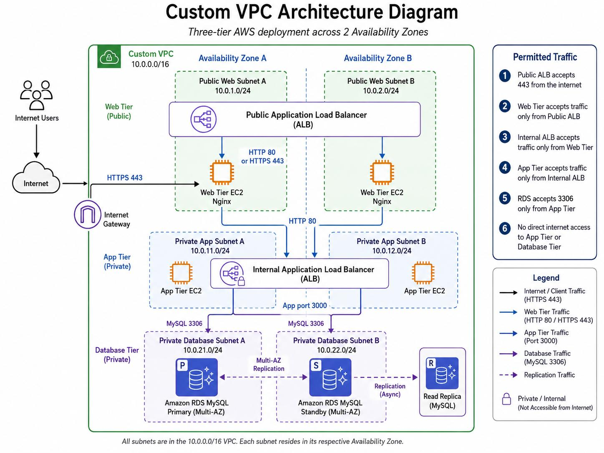
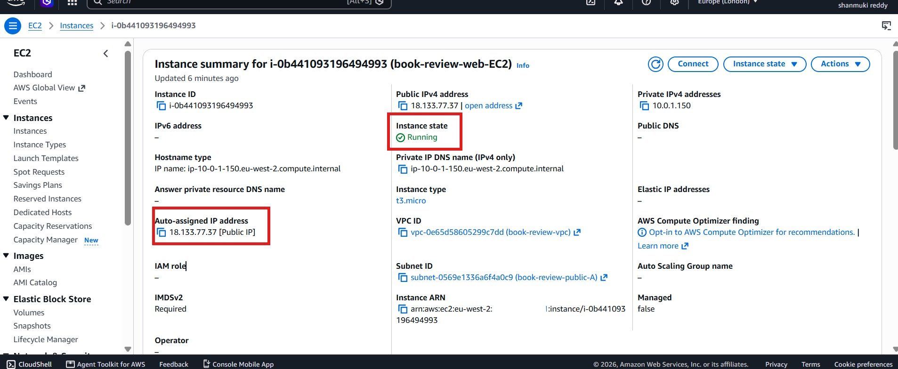
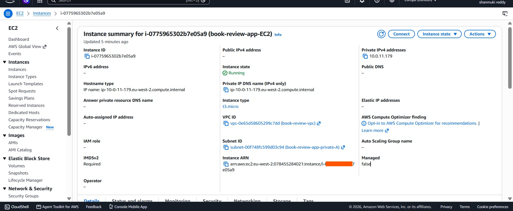
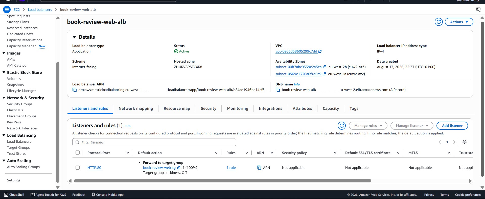
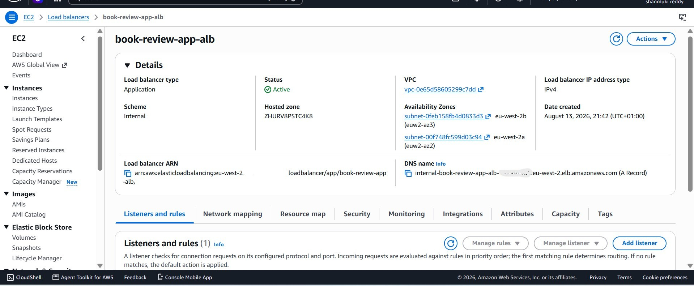
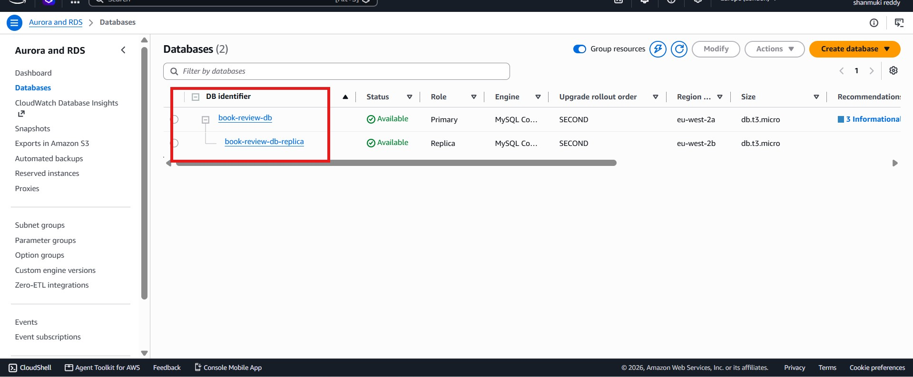
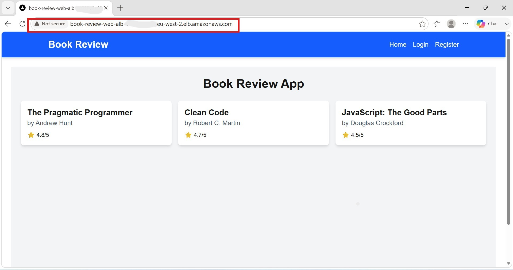
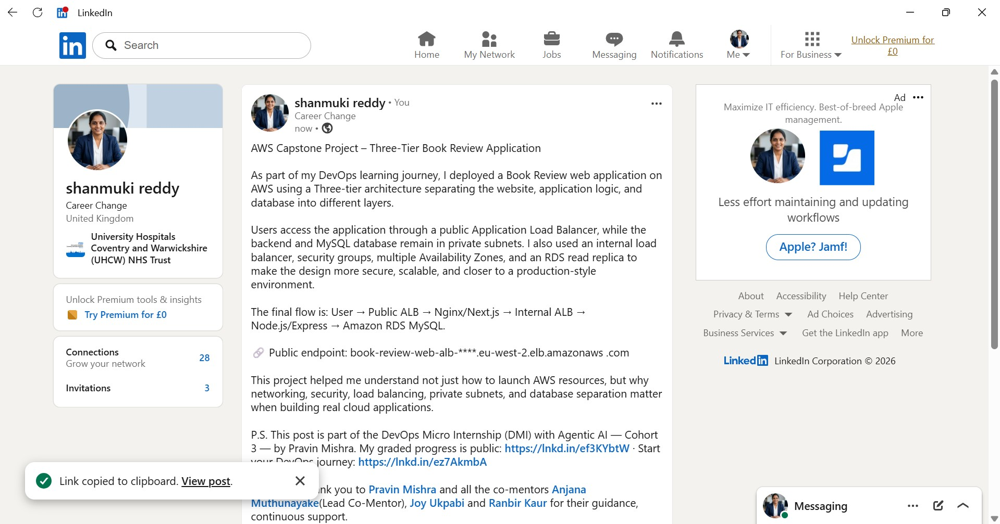

# Assignment 6 — Capstone Assignment — Deploy Book Review App (Three-Tier Architecture) on AWS

Part of the DevOps Micro Internship (DMI) Cohort 3 with Agentic AI

---

## Purpose

This is the most important assignment of the course. You will deploy the Book Review App in a fully production-style three-tier architecture on AWS: a Next.js Web Tier behind Nginx and a public ALB, a private Node.js/Express App Tier behind an internal ALB, and a private Multi-AZ MySQL RDS database with a read replica. You are expected to design, deploy, isolate, debug, and document the result independently.

---

# Task 1 — Architecture Diagram

## Goal

Create an architecture diagram showing the custom VPC (10.0.0.0/16), the six subnets across two Availability Zones (two public Web Tier, two private App Tier, two private Database Tier), the public ALB, Web Tier EC2/Nginx, internal ALB, private App Tier EC2, private Multi-AZ RDS with its read replica, and the permitted traffic flow.

### Evidence

#### Diagram image or link

# Task 2 — AWS Region & Services Used

## Goal

Record the AWS Region used and list every AWS service used across networking, compute, load balancing, security, and the database.

### Notes

**Region:**

Europe (London) — eu-west-2

---

**Services:**

The following AWS services and components were used for the Book Review three-tier deployment:

Amazon VPC — custom VPC using 10.0.0.0/16
Amazon VPC Subnets — two public Web Tier subnets, two private App Tier subnets, and two private Database Tier subnets across two Availability Zones
Internet Gateway (IGW) — provides internet connectivity to the public Web Tier
NAT Gateway — provides outbound internet access for resources in the private App Tier
Elastic IP — allocated to the NAT Gateway
Route Tables — separate public, private App, and private Database routing
Amazon EC2 — Ubuntu instances for the Web Tier and App Tier
Elastic Load Balancing — Application Load Balancer (ALB) — public ALB for the Web Tier and internal ALB for the App Tier
Target Groups — Web target group on port 80 and App target group on port 3001
Security Groups — controlled access between the public, Web, App, and Database tiers
Amazon RDS for MySQL — private relational database
RDS DB Subnet Group — places the database across the private Database subnets
Amazon RDS Multi-AZ / Read Replica — to be included in the final evidence after successful completion of the rebuilt database architecture

---

# Task 3 — Public Entry Point

## Goal

Confirm the Book Review App loads through the public ALB DNS name.

### Evidence

#### Public ALB DNS

Paste your public ALB DNS name here:

http://book-review-web-alb-1714970024.eu-west-2.elb.amazonaws.com

---

# Task 4 — Evidence Screenshots

## Goal

Capture visual proof of every tier and load balancer.

### Evidence

#### Web EC2

---

#### App EC2

---

#### Public ALB

---

#### Internal ALB

---

#### RDS + Replica

---

#### App UI proof

---

# Task 5 — Summary

## Goal

Summarize what worked in the final deployment, the issues encountered and how each was fixed, and the tools or sources used to research and debug.

### Notes

**What worked:**

The three-tier application components were successfully deployed and tested independently.
==> The Next.js frontend was built and served through Nginx on the Web EC2 instance.
==> The Node.js/Express backend successfully connected to the private Amazon RDS MySQL database using SSL and ran on port 3001. 
==> The internal Application Load Balancer successfully forwarded requests to the App EC2 through a healthy target group on port 3001.

End-to-end private application communication was also verified from the Web EC2. 
A request to /api/books through Nginx was successfully forwarded to the internal ALB, then to the Node.js backend and RDS database, returning HTTP 200 OK with the expected book data.

---

**Issues + fixes:**

Several configuration issues were identified during deployment and troubleshooting:

1.RDS connectivity timeout: RDS was initially attached to the default security group. This was fixed by attaching Book-Review-DB-SG and allowing MySQL port 3306 only from the App Tier security group.
2.Incorrect backend port: Port 3306 was initially entered as the application port. This was corrected to 3001, while 3306 remained the MySQL database port.
3.Incorrect App target group: The original target group was configured on port 80 with a target override. A new App target group was created correctly on HTTP port 3001.
4.Incorrect App ALB scheme: The first App ALB was accidentally created as internet-facing. It was replaced with an Internal Application Load Balancer deployed in the private App subnets.
5.Incorrect Nginx upstream DNS: An incorrect internal ALB hostname caused Nginx configuration errors. The exact internal ALB DNS was copied from AWS and configured correctly.
6.Public application access: Although the Web EC2, Nginx, internal ALB, backend and database communication were successfully verified, the previous Public ALB still timed out from the browser. A clean rebuild was therefore chosen to remove accumulated configuration issues and recreate the architecture.

---

**Tools/sources used:**

The following tools and resources were used during deployment and troubleshooting:

   * AWS Management Console
   * AWS VPC, EC2, ALB, Target Groups, Security Groups and RDS consoles
   * Ubuntu Linux terminal
   * SSH and SCP
   * curl for HTTP/API connectivity testing
   * MySQL command-line client
   * Nginx
   * Node.js and npm
   * PM2 process manager
   * Git and GitHub
   * Book Review App GitHub repository
   * Frontend and backend README documentation
   * AWS official documentation
   * DMI Assignment 6 solution walkthrough and troubleshooting guide
   * ChatGPT for architecture planning, debugging and configuration review

---

# LinkedIn Post (Required)

## Goal

Publish a LinkedIn post sharing the capstone deployment, including the public ALB DNS (or a redacted screenshot), three to five lines on what you built and why it is production-style, and one proof screenshot.

## Evidence

#### LinkedIn Post URL

Paste your LinkedIn post URL here:

https://www.linkedin.com/posts/shanmuki-reddy_aws-devops-cloudcomputing-ugcPost-7493793666441015296-CAaP/?utm_source=share&utm_medium=member_desktop&rcm=ACoAAE0LbgwBcO3gizrVfuqLPvGD60OHg7LFHRw

---

#### Screenshot of LinkedIn post

---

# Submission Instructions

- Add all required screenshots and links in your submission
- Do not expose passwords, RDS credentials, connection strings, private keys, or account IDs

---

# Completion Checklist

- [ ] Task 1: Architecture diagram completed
- [ ] Task 2: AWS Region and services documented
- [ ] Task 3: Public ALB DNS confirmed working
- [ ] Task 4: All six evidence screenshots captured (Web Tier, App Tier, both ALBs, RDS + replica, app UI)
- [ ] Task 5: Deployment summary completed (what worked, issues/fixes, tools/sources)
- [ ] LinkedIn post published and URL submitted
- [ ] App Tier and Database Tier confirmed not publicly accessible
- [ ] No sensitive data exposed

---

## 📌 About DMI & CloudAdvisory

DevOps Micro Internship (DMI) is a project-based DevOps program run by Pravin Mishra (The CloudAdvisory) focused on real-world execution, systems thinking, and career readiness.

It helps learners build strong DevOps foundations with hands-on experience.

---

## 📌 Resources

- 🌐 DMI Official Website: https://dmi.pravinmishra.com?utm_source=github&utm_medium=readme  
- 🎓 University: https://university.pravinmishra.com?utm_source=github&utm_medium=readme  
- 💬 Discord Community: https://discord.pravinmishra.com?utm_source=github&utm_medium=readme  
- 📝 Blog: https://dmi.pravinmishra.com/blog?utm_source=github&utm_medium=readme  
- ▶️ YouTube Playlist: https://www.youtube.com/playlist?list=PLFeSNDtI4Cho  
- 🔗 Pravin Mishra (LinkedIn): https://www.linkedin.com/in/pravin-mishra-aws-trainer/  
- 🏢 CloudAdvisory (LinkedIn): https://www.linkedin.com/company/thecloudadvisory/

---

*This submission is part of DevOps Micro Internship (DMI) Cohort 3 — Agentic AI Track.*