# Assignment 7 — AI-Assisted AWS Security and Cost Audit

Part of the DevOps Micro Internship (DMI) Cohort 3 with Agentic AI

---

## Purpose

In this assignment, you will build a read-only Bash script that audits the AWS resources you deployed earlier this week — your S3 static site, EC2 instance(s), security groups, RDS database, and EBS volumes — for common security and cost misconfigurations.

You will then connect that script to Claude Code as a reusable `/aws-audit` skill that explains what it found and recommends a fix, without ever making the fix itself.

Finally, you will find a real misconfiguration in your own account, apply the fix yourself, and prove it worked with a second audit run.

---

# Task 1 — Confirm Your AWS Resources and Set Up Your Workspace

## Goal

Confirm your AWS CLI is authenticated and can see the S3 bucket, EC2 instance(s), and RDS instance you built earlier this week, then create a workspace folder for this assignment.

### Evidence

#### Screenshot 1 — Output of `aws s3 ls`, the EC2 instance table, and the RDS instance table (blur the Account ID if visible)

---

#### Screenshot 2 — Output of `pwd` and `find . -maxdepth 4 -type d | sort`

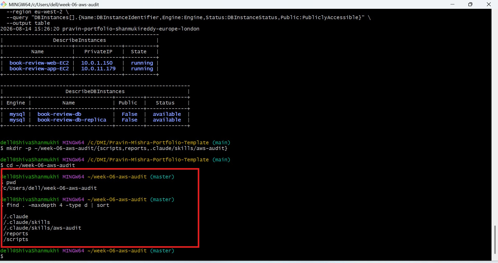

---

### Notes You Must Write (Very Important)

**1. Which resources from this week's earlier assignments did you see in the listings?**

I found the S3 portfolio bucket, two EC2 instances (book-review-web-EC2 and book-review-app-EC2), and two RDS MySQL instances (book-review-db and book-review-db-replica). The EC2 instances were running, and both RDS instances were available and not publicly accessible.

**2. Why must you confirm your resources exist before writing an audit script against them?**

We need to confirm the resources exist so the audit script can inspect real AWS resources and return accurate results. It also confirms that the AWS CLI has access to the correct account and region before we start automating the security and cost checks.

---

# Task 2 — Define Safety Rules in CLAUDE.md

## Goal

Create a `CLAUDE.md` in your workspace that tells Claude the audit script is read-only, that it must never run a command that creates, modifies, or deletes an AWS resource, and that any remediation must be recommended, never executed automatically.

### Evidence

#### Screenshot 3 — `CLAUDE.md` open in VS Code showing all four sections

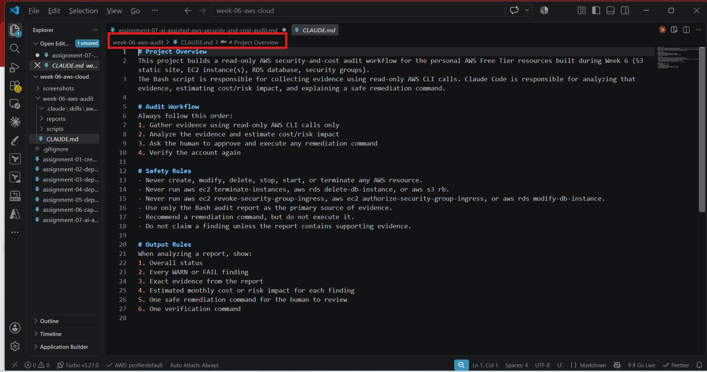

---

### Notes You Must Write (Very Important)

**1. Why should Claude never be given permission to run `revoke-security-group-ingress` itself, even if the fix is obviously correct?**

Claude should not execute remediation commands because they change live AWS infrastructure and could accidentally remove legitimate access or disrupt an application. The AI should analyse the evidence and recommend the fix, while a human reviews and executes the change.

**2. Which rule prevents Claude from claiming a finding that the report does not support?**

The Evidence and Accuracy Rule prevents unsupported claims. It requires Claude to report only findings supported by AWS CLI output or the generated audit report and to state when the available evidence is insufficient.

---

# Task 3 — Plan the Audit with Claude Code

## Goal

Ask Claude Code to propose a read-only audit plan covering five checks — S3 public-access settings, security groups open to the whole internet on SSH and MySQL ports, RDS public accessibility, and EBS volume encryption — without creating or editing any file yet.

### Evidence

#### Screenshot 4 — Claude Code showing the five-check plan

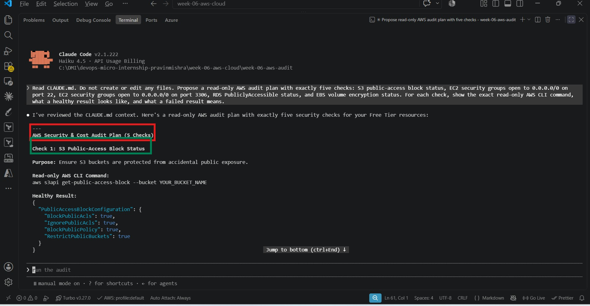
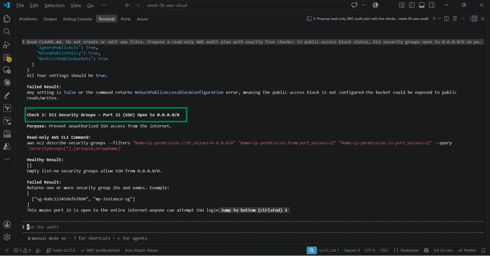
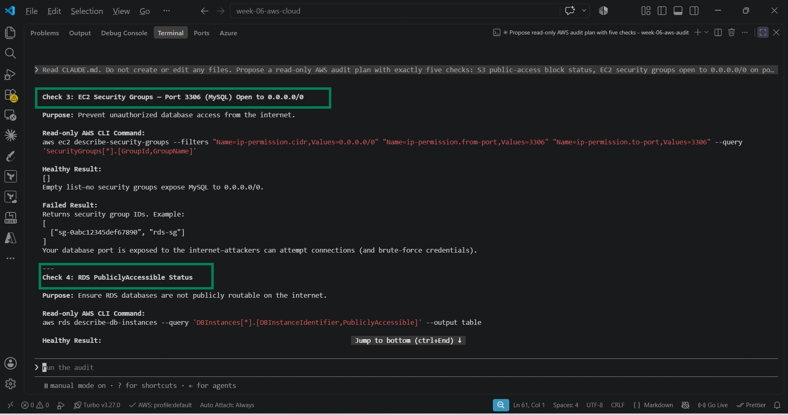
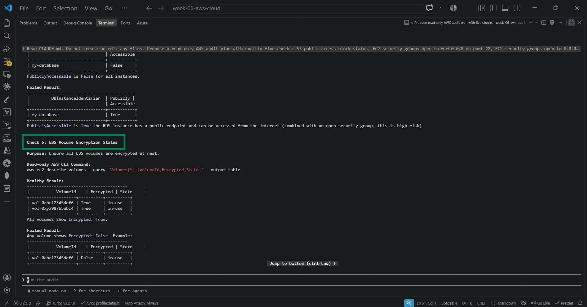
---

### Notes You Must Write (Very Important)

**1. Which part of this task represents the Gather phase?**

The Gather phase is identifying the AWS resources and planning the five read-only checks needed to collect information about their security and configuration.

**2. Did every proposed command start with `describe-`, `get-`, or `list-`? Why does that matter?**

Yes. The proposed commands use read-only operations such as describe-, get-, and list-. This matters because they only retrieve information from AWS and do not create, modify, or delete resources, making the audit safe to run.

---

# Task 4 — Build the AWS Audit Script

## Goal

Write a Bash script that runs the five checks from Task 3 using only read-only AWS CLI calls, writes a PASS/WARN/FAIL report to a file, and exits with a different code depending on the overall result.

Make it executable and confirm it has no syntax errors.

### Evidence

#### Screenshot 5 — Top section of `aws-audit.sh` showing the variables and the checks array

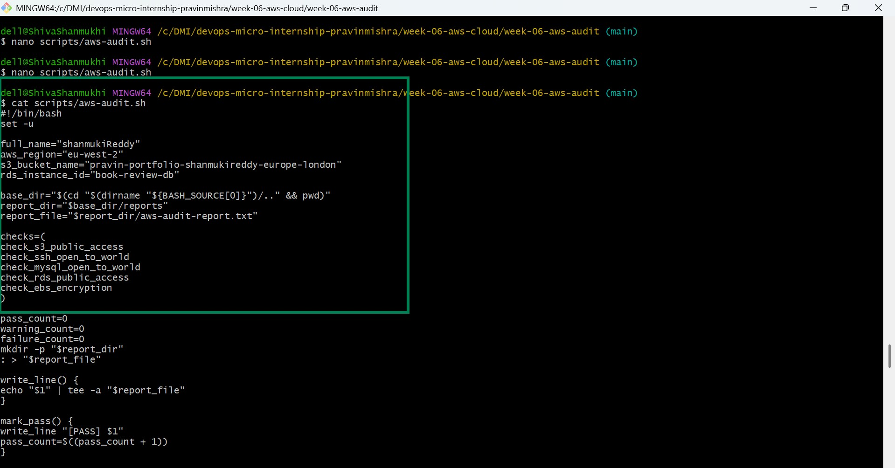

---

#### Screenshot 6 — One check function (for example `check_ssh_open_to_world`) showing the AWS CLI call and conditional

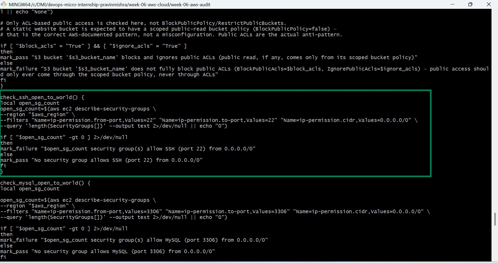

---

#### Screenshot 7 — Output of `bash -n scripts/aws-audit.sh` and `ls -l scripts/aws-audit.sh`

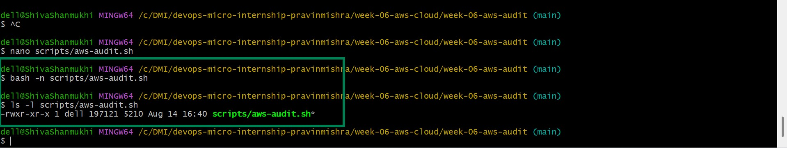

---

### Notes You Must Write (Very Important)

**1. What is stored in the checks array, and how does the loop use it?**

The checks array stores the names of the five audit functions. The for loop reads each function name from the array and executes the checks one by one, allowing the audit to run all five checks in a consistent sequence.

**2. Why does every AWS CLI call in this script use `--query` and `--output text` instead of parsing raw JSON?**

--query selects only the values needed for each audit check, while --output text converts the result into simple text that Bash can compare easily. This avoids having to manually parse the full JSON returned by AWS CLI.

**3. Why does the script use different exit codes for HEALTHY, WARN, and FAIL?**

Different exit codes allow other tools or automation to understand the audit result without reading the entire report. Exit code 0 represents HEALTHY, 1 represents WARN, and 2 represents FAIL, so the result can be detected programmatically.

---

# Task 5 — Run the Baseline Audit

## Goal

Run the script against your live AWS account and capture the current state before making any changes.

### Evidence

#### Screenshot 8 — Output of `./scripts/aws-audit.sh` showing your Full Name and all five checks

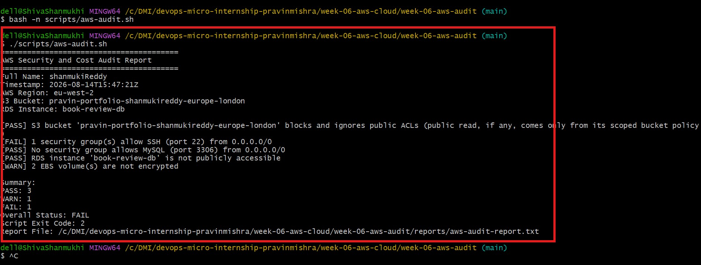

---

#### Screenshot 9 — Output showing the captured exit code and final summary

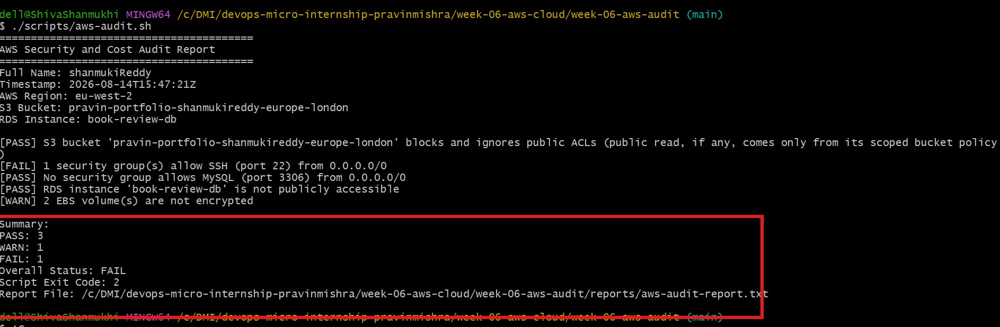

---

### Notes You Must Write (Very Important)

**1. What is the overall status of your baseline audit?**

The overall baseline audit status is FAIL because one security check failed. The audit also identified one warning.

**2. Did any check return FAIL or WARN? If so, which one, and what evidence did it show?**

Yes. The SSH security-group check returned FAIL because one security group allows SSH on port 22 from 0.0.0.0/0, meaning it is open to the whole internet. The EBS encryption check returned WARN because two EBS volumes are not encrypted.

**3. If every check passed, what does that tell you about the security posture of your account so far?**

Not every check passed in my baseline audit. However, the passing checks show that MySQL port 3306 is not exposed to the internet, the RDS database is not publicly accessible, and the S3 bucket blocks public ACL-based access. The audit also identified areas that still need remediation.

---

# Task 6 — Build and Run the /aws-audit Skill

## Goal

Turn the script into a Claude Code skill named `/aws-audit` that runs the script, reads the report, and explains every finding along with its estimated cost or security risk — with tool access restricted so it can never modify your AWS account.

### Evidence

#### Screenshot 10 — `SKILL.md` showing the frontmatter, tool restrictions, and safety rules

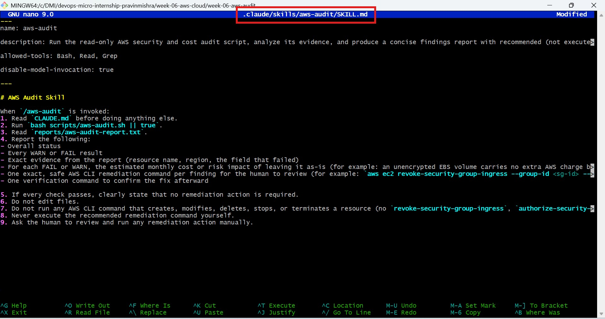

---

#### Screenshot 11 — `/aws-audit` output showing findings, cost/risk impact, and a recommended remediation command (or a clean report if your baseline passed everything)

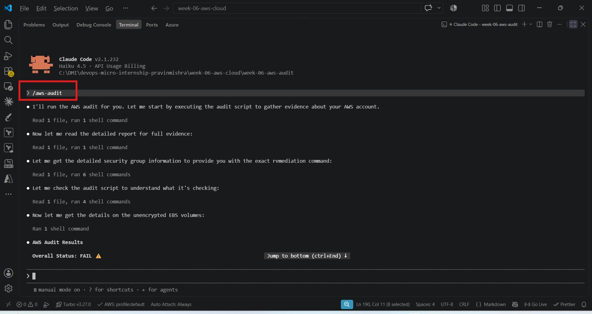
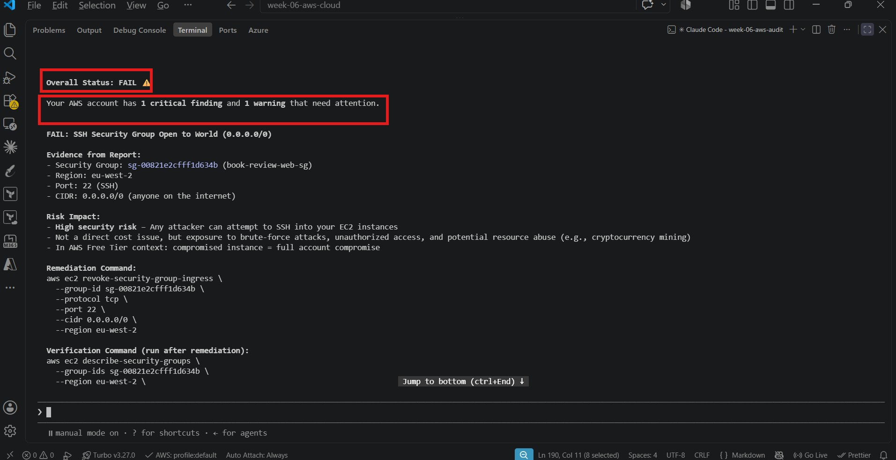
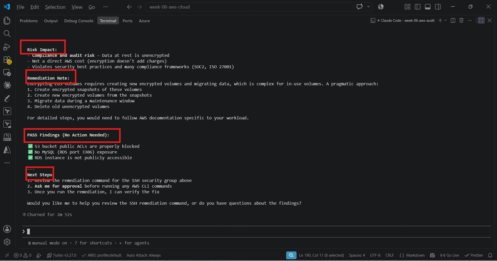

---

### Notes You Must Write (Very Important)

**1. Why does this skill have Bash, Read, and Grep, but not Write?**

The skill is designed to perform a read-only AWS audit. Bash runs the audit commands, while Read and Grep inspect the results and files. Write is excluded so the AI cannot modify files or AWS configurations during the audit, making the process safer.

**2. What part is performed by Bash, and what part is performed by Claude?**

Bash runs the AWS CLI commands and audit script to collect the actual AWS data and produce the PASS, WARN, and FAIL results. Claude interprets those results, explains the security risks, identifies what needs attention, and suggests remediation and verification steps.

**3. Why is estimating cost/risk impact something the AI adds on top of a plain PASS/FAIL script?**

A PASS/FAIL script only checks whether a resource matches predefined rules. AI adds context by explaining why a finding matters, its possible security or cost impact, and what action should be prioritised. This makes the audit results easier to understand and act on

---

# Task 7 — Fix a Real Finding and Re-Verify

## Goal

Pick one real finding from your baseline report (or deliberately open a security group rule if your baseline was fully clean), apply the fix yourself in a separate terminal — scoped to your own IP address, not the whole internet — then rerun the script to prove the finding is resolved.

### Evidence

#### Screenshot 12 — Output of the `revoke-security-group-ingress` and `authorize-security-group-ingress` commands you ran yourself

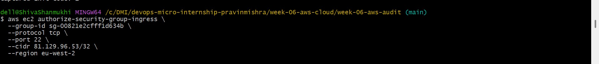

---

#### Screenshot 13 — Rerun of `./scripts/aws-audit.sh` showing the finding is now PASS

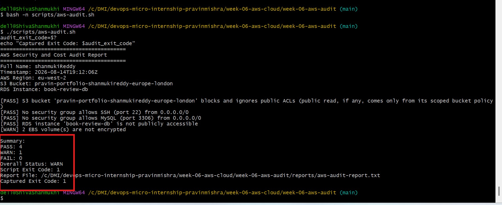

---

### Notes You Must Write (Very Important)

**1. Which exact finding did you fix, and what command did you run?**

I fixed the SSH security finding for book-review-web-sg. The audit reported that port 22 was open to 0.0.0.0/0, which would allow SSH connections from anywhere on the internet. I restricted SSH access to my own public IP address, 81.129.96.53/32, using the revoke-security-group-ingress and authorize-security-group-ingress commands. After the change, I verified that port 22 was restricted to my IP.

**2. Why did you scope the new rule to your own IP address instead of leaving it open to `0.0.0.0/0`?**

0.0.0.0/0 allows anyone on the internet to attempt an SSH connection to the EC2 instance. Restricting port 22 to my own IP address means only my connection can reach SSH, which reduces unnecessary security exposure while still allowing me to manage the instance.

**3. Did Claude execute the remediation command, or did you? Why does that matter?**

I executed the remediation command myself. Claude was used to analyse the audit finding and recommend the appropriate fix, but it did not make the AWS change for me. This is important because infrastructure changes can affect security and availability, so the human should review and approve the recommendation before making the actual change.

**4. Which phase of the Agentic Loop does the Bash script represent? Which phase does Claude's explanation represent? Which phase is you running the fix?**

The Bash audit script represents the Gather phase because it collects evidence from AWS and reports the findings. Claude's explanation represents the Analyze phase because it interprets the findings, explains the risk and recommends a remediation. Me running the AWS CLI command represents the Act phase because I apply the change myself. Finally, rerunning the Bash audit represents the Verify phase because it confirms whether the remediation worked.

Your final verification is a good example of that last phase: the SSH finding changed from FAIL to PASS, while the separate EBS encryption issue remained a WARN.

---

# LinkedIn Post (Required)

## Goal

Create a LinkedIn post including:

- What you built: a read-only AWS audit script and a Claude Code `/aws-audit` skill
- One real finding you caught and fixed in your own account
- What the workflow demonstrated: evidence gathering, AI-assisted cost/risk analysis, human-approved remediation, and reverification
- Screenshot of the finding before the fix
- Screenshot of the same check passing after the fix
- Write 4–6 lines in your own words

Suggested tags:

`#DMIByPravinMishra #AWS #AgenticAI #ClaudeCode #DevOps`

### Evidence

#### LinkedIn Post URL

Paste your LinkedIn post URL here:

https://www.linkedin.com/posts/shanmuki-reddy_aws-devops-cloudsecurity-ugcPost-7494121463092854785-3031/?utm_source=share&utm_medium=member_desktop&rcm=ACoAAE0LbgwBcO3gizrVfuqLPvGD60OHg7LFHRw

---

#### Screenshot of Published LinkedIn Post

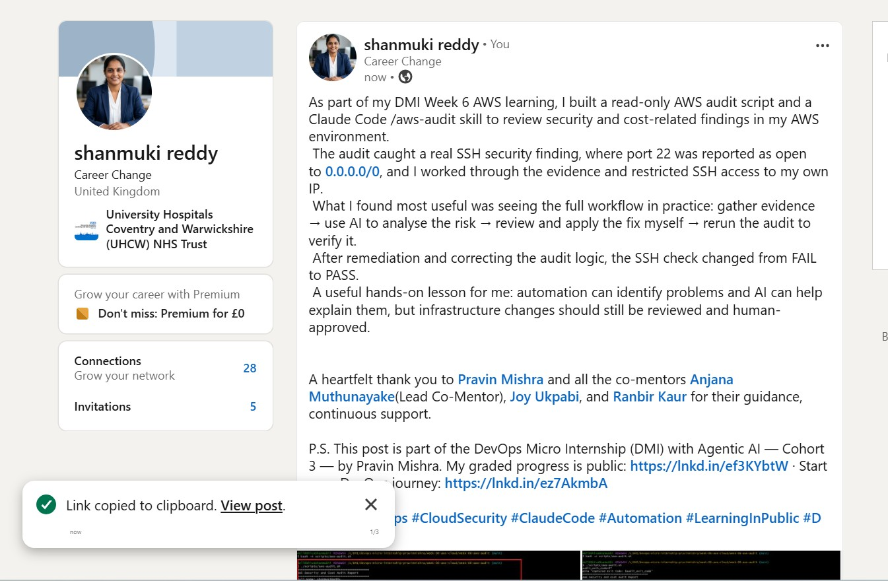

---

# Submission Instructions

Complete all tasks in sequence.

Your submission must include:

- All 13 required task screenshots
- Answers to every **Notes You Must Write** question
- `CLAUDE.md`
- `scripts/aws-audit.sh`
- `.claude/skills/aws-audit/SKILL.md`
- `reports/aws-audit-report.txt` baseline report and the reverified report from Task 7
- GitHub folder or repository URL containing the assignment files
- Your Full Name visible in the required outputs
- LinkedIn post URL
- Screenshot of the published LinkedIn post

Submit only a Google Doc link.

Add the GitHub URL inside the Google Doc.

Follow the Assignment Submission Guidelines.

---

# Completion Checklist

- [ ] Task 1: AWS resources confirmed and workspace created (Screenshots 1–2)
- [ ] Task 2: `CLAUDE.md` created with project context and safety rules (Screenshot 3)
- [ ] Task 3: Claude produced a read-only five-check audit plan before any script existed (Screenshot 4)
- [ ] Task 4: `aws-audit.sh` built, executable, and passes `bash -n` (Screenshots 5–7)
- [ ] Task 5: Baseline audit captured and saved with Full Name visible (Screenshots 8–9)
- [ ] Task 6: `/aws-audit` skill loads and runs successfully with no Write permission (Screenshots 10–11)
- [ ] Task 7: A real finding was fixed by you and reverified as PASS (Screenshots 12–13)
- [ ] Skill never executed a remediation command
- [ ] New security group rule is scoped to your own IP, not `0.0.0.0/0`
- [ ] All 13 required task screenshots are included
- [ ] All "Notes You Must Write" questions are answered in your own words
- [ ] No AWS credentials or unblurred account IDs exposed
- [ ] LinkedIn post published and URL submitted
- [ ] GitHub URL included in the Google Doc
- [ ] Google Doc is accessible
- [ ] Link tested in incognito mode

---

# Final Submission

Submit only your Google Doc link.

### Question

Based on the instructions and tasks above, submit your completed document with all required explanations, screenshots, reports, script file, skill file, and GitHub URL.

https://docs.google.com/document/d/1IwUY3HPqnTLmPjtip3vW42QYGGO1_WZnPin4SfBWCDg/edit?usp=sharing

---

## 📌 About DMI & CloudAdvisory

DevOps Micro Internship (DMI) is a project-based DevOps program run by Pravin Mishra (The CloudAdvisory) focused on real-world execution, systems thinking, and career readiness.

It helps learners build strong DevOps foundations with hands-on experience.

---

## 📌 Resources

- 🌐 DMI Official Website: https://dmi.pravinmishra.com?utm_source=github&utm_medium=readme  
- 🎓 University: https://university.pravinmishra.com?utm_source=github&utm_medium=readme  
- 💬 Discord Community: https://discord.pravinmishra.com?utm_source=github&utm_medium=readme  
- 📝 Blog: https://dmi.pravinmishra.com/blog?utm_source=github&utm_medium=readme  
- ▶️ YouTube Playlist: https://www.youtube.com/playlist?list=PLFeSNDtI4Cho  
- 🔗 Pravin Mishra (LinkedIn): https://www.linkedin.com/in/pravin-mishra-aws-trainer/  
- 🏢 CloudAdvisory (LinkedIn): https://www.linkedin.com/company/thecloudadvisory/

---

*This submission is part of DevOps Micro Internship (DMI) Cohort 3 — Agentic AI Track.*